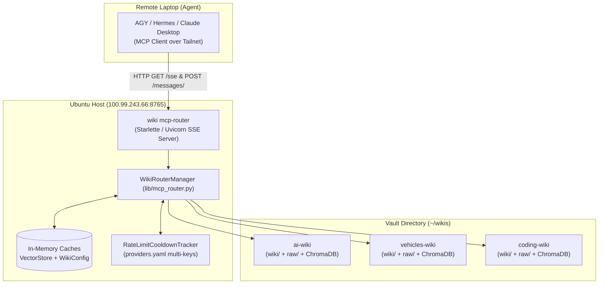

# Centralized Multi-Wiki MCP Router: Architecture & Implementation Guide

## 1. Overview & Purpose

The **Centralized Multi-Wiki MCP Router** is an always-on, unified gateway service hosted on your Ubuntu server (`100.99.243.66`). It implements the official [Model Context Protocol (MCP)](https://modelcontextprotocol.io/) over Server-Sent Events (SSE), allowing external AI assistants (e.g., AGY, Hermes, Claude Desktop) across your secure Tailnet to seamlessly explore, read, traverse, and query multiple independent Obsidian/LLM knowledge vaults.

### Core Problems Solved
1. **Zero Client Configuration:** Remote laptops and agents do not need local API keys, embedding models, Python environments, or ChromaDB binaries. All heavy LLM synthesis and vector queries execute on the Ubuntu server.
2. **Multi-Vault Isolation:** A single persistent connection dynamically routes requests to any vault in `~/wikis/` (e.g. `ai-wiki`, `vehicles-wiki`, `coding-wiki`) without cross-vault context pollution.
3. **Syncthing Conflict Prevention:** Direct mutations to compiled markdown pages are avoided. Remote agents contribute through non-conflicting drop paths (`raw/inbox/` and `wiki/log.md`), allowing Syncthing to sync files without merge collisions.
4. **Global Key & Quota Optimization:** A centralized cooldown tracker coordinates API rate limits across all wikis, preventing repeated failed requests when a key is exhausted.

---

## 2. Architecture & Networking



### Network Topology
- **Tailscale IP:** `100.99.243.66` (invisible to the public internet).
- **Port:** `8765` (preserves port `8080` for the host's Gotify service).
- **Transport:** Official MCP SSE transport:
  - `GET /sse`: Initiates the Server-Sent Events stream and assigns a session ID.
  - `POST /messages/?session_id=<id>`: Bidirectional JSON-RPC tool invocation endpoint.

---

## 3. Dynamic Vault Discovery & Layout

### Vault Directory Convention
The router monitors a base folder (default: `~/wikis/`, configurable via `--base-dir`).
A directory `~/wikis/<vault_name>` is recognized as a valid wiki if:
1. `(folder / "wiki").is_dir()` is true.
2. Metadata is extracted from `wiki.yaml` or `.llm-wiki/config.yaml` (`domain.description`).

### Lazy Discovery (No Restarts Required)
Discovery is performed live when `list_wikis()` is called. When Syncthing drops a new vault folder onto the server, the router immediately recognizes it without needing a restart.

---

## 4. MCP Tools Catalog

The router exposes 14 tools covering discovery, semantic querying, graph traversal, health telemetry, and safe note contribution:

### 4.1 Discovery & Structure Tools

| Tool | Parameters | Description | Output Format |
| :--- | :--- | :--- | :--- |
| `list_wikis` | *None* | Scans `~/wikis` and lists all available vaults with page counts. | JSON array of objects (`name`, `description`, `page_count`) |
| `get_wiki_skeleton` | `wiki_name: str`, `category: Optional[str]` | Returns full table of contents grouped by category (`concepts`, `entities`, `topics`, etc.). | JSON object with categories and page slugs |
| `get_wiki_status` | `wiki_name: str` | Returns structural metrics (total pages, raw sources, concepts, entities, topics). | JSON object with category counts |
| `get_recent_changes` | `wiki_name: Optional[str]`, `days: int = 7`, `limit: int = 20` | Returns recent page creations and modifications across one or all wikis. | JSON array of objects (`wiki`, `path`, `title`, `modified`, `type`) |

### 4.2 Reading & Querying Tools

| Tool | Parameters | Description | Output Format |
| :--- | :--- | :--- | :--- |
| `read_wiki_page` | `wiki_name: str`, `page_slug: str` | Fetches raw Markdown content using flexible slug resolution (fuzzy base names, auto `.md`). | Plain Markdown string |
| `query_wiki` | `wiki_name: str`, `query: str` | Executes semantic RAG search with graph-based truncation and server-side model fallback chains. | Plain Markdown synthesized answer with `[[wikilinks]]` and sources |
| `search_wiki` | `wiki_name: str`, `query: str`, `limit: int = 5` | Lightweight semantic vector search returning top matching snippets with similarity distance (zero synthesis tokens). | JSON array of objects (`wiki`, `path`, `title`, `snippet`, `distance`) |
| `search_all_wikis` | `query: str`, `limit_per_wiki: int = 3` | Federated cross-vault semantic search across all discovered wikis on the server. | JSON object (`query`, `searched_wikis`, `total_hits`, `results`) |

### 4.3 Knowledge Graph Traversal & Insights Tools

| Tool | Parameters | Description | Output Format |
| :--- | :--- | :--- | :--- |
| `get_page_links` | `wiki_name: str`, `page_slug: str` | Traverses graph: extracts outgoing `[[wikilinks]]` and incoming backlinks with slug normalization. | JSON object (`page`, `outgoing_links`, `backlinks`) |
| `get_entity_info` | `wiki_name: str`, `entity_name: str` | Returns frontmatter metadata, raw source citations list, summary, and links. | JSON object with entity properties |
| `get_graph_insights` | `wiki_name: str` | Analyzes vault structure: top authority hubs, orphan notes with no backlinks, dead links, and link density. | JSON object (`total_pages`, `link_density`, `top_hubs`, `orphans`, `dead_links`) |

### 4.4 Telemetry & Safe Contribution Tools

| Tool | Parameters | Description | Output Format |
| :--- | :--- | :--- | :--- |
| `get_router_health` | *None* | Runtime health, cached vector store instances, and active provider rate-limit cooldowns. | JSON object (`status`, `total_wikis`, `cached_vector_stores`, `active_rate_limit_cooldowns`) |
| `add_inbox_note` | `wiki_name: str`, `title: str`, `content: str`, `tags: Optional[List[str]]` | Drops a new note into `raw/inbox/{date}-{slug}.md` with frontmatter, avoiding Syncthing merge conflicts. | Confirmation string with saved path |
| `append_to_log` | `wiki_name: str`, `entry_text: str` | Appends a timestamped research discovery to `wiki/log.md`. | Confirmation string |

---

## 5. Performance & Optimization Architecture

### 5.1 In-Memory Vector Store Caching
Loading ChromaDB collections from disk on every tool call adds noticeable latency.
`WikiRouterManager` maintains an in-memory store cache:
```python
self._store_cache: Dict[str, WikiVectorStore] = {}
```
* **First Query:** Initializes the persistent Chroma client at `<vault>/wiki/.llm-wiki/chroma_db` and caches it.
* **Subsequent Queries:** Reuses the active client instantly from memory.

### 5.2 Global Key Cooldown Tracker (`RateLimitCooldownTracker`)
All wiki vaults share the server's cloud API key configuration (`~/.config/llm-wiki/providers.yaml`).
* When an LLM call hits an HTTP `429` (Rate Limit) or `resource_exhausted` quota error, the model is flagged with a **60-second cooldown**:
  ```python
  RateLimitCooldownTracker.mark_cooling_down(model_id, cooldown_seconds=60.0)
  ```
* Subsequent requests for **any** wiki skip the cooled model immediately, falling forward to the next key (e.g. `groq 2` or `google 3`) without waiting on failed network requests.
* When the cooldown expires, the model is seamlessly restored to rotation.
* If all candidate models are cooling down, the tracker bypasses the restriction so queries do not deadlock.

---

## 6. Implementation Code Structure

The implementation is modular and integrated directly into the `llm-wiki` package:

```
llm wiki/
├── cli/
│   ├── main.py               # Registers 'wiki mcp-router' CLI command
│   └── mcp_router_cmd.py     # Click CLI handler & Starlette SSE server setup
├── lib/
│   ├── mcp_router.py         # WikiRouterManager: discovery, tools logic, slug resolver
│   ├── providers.py          # LLMProvider + RateLimitCooldownTracker
│   ├── vector_store.py       # ChromaDB WikiVectorStore (reused in cache)
│   └── wiki_ops.py           # run_query supporting cached store parameter
├── tests/
│   ├── test_mcp_router.py    # 10 unit tests for WikiRouterManager
│   └── test_mcp_router_cmd.py# Unit tests for CLI server creation and tool schemas
└── pyproject.toml            # Added mcp>=1.2.0 dependency
```

---

## 7. Service Deployment & Operations

### 7.1 Systemd User Service
The router runs as a managed user daemon on Ubuntu:
File: `~/.config/systemd/user/llm-wiki-router.service`
```ini
[Unit]
Description=LLM Multi-Wiki Centralized MCP Router
After=network.target

[Service]
Type=simple
ExecStart=/home/ubuntu/.local/bin/wiki mcp-router --base-dir /home/ubuntu/wikis --host 100.99.243.66 --port 8765
Restart=always
RestartSec=5
WorkingDirectory=/home/ubuntu
Environment=PYTHONUNBUFFERED=1

[Install]
WantedBy=default.target
```

### 7.2 Service Commands
```bash
# Check running status
systemctl --user status llm-wiki-router.service

# Stream live server logs
journalctl --user -u llm-wiki-router.service -f

# Restart service after editing code (< 1s reload)
systemctl --user restart llm-wiki-router.service

# Stop service
systemctl --user stop llm-wiki-router.service
```

### 7.3 Persistent Background Execution
User lingering is enabled (`loginctl enable-linger $USER`), ensuring systemd keeps the service alive even when all SSH sessions are closed.

---

## 8. Client Agent Configuration

To connect remote assistants (AGY, Hermes, Claude Desktop) from your laptop to the Ubuntu router:

### Antigravity (AGY) & Hermes Config
In `~/.config/antigravity/mcp.json` or your agent's MCP settings:
```json
{
  "mcpServers": {
    "global-wiki-router": {
      "url": "http://100.99.243.66:8765/sse"
    }
  }
}
```

### Typical Agent Interaction Flow
1. **Discovery:** When the agent starts, it lists available tools and calls `list_wikis()`.
2. **Context Selection:** Answering an EV query, it calls `get_wiki_skeleton(wiki_name="vehicles-wiki")` or `query_wiki(wiki_name="vehicles-wiki", query="...")`.
3. **Graph Traversal:** Reading a concept note, it calls `get_page_links` to traverse connected notes.
4. **Contribution:** When the agent discovers a new paper or fact, it calls `add_inbox_note` to deposit a raw note into the server's vault for downstream ingestion.

---

## 9. Safe Future Development (Zero Downtime)

When adding new features or tools:
1. **Work in Git:** Make edits in `/home/ubuntu/llm wiki`.
2. **Run Tests:** `uv run --with pytest pytest tests/` (verifies all 44 unit and integration tests).
3. **Dual-Port Dev Testing (Optional):** Start a test instance on a separate port without disrupting production:
   ```bash
   wiki mcp-router --base-dir ~/wikis --host 100.99.243.66 --port 8766
   ```
4. **Reload Production:** Restart the service:
   ```bash
   systemctl --user restart llm-wiki-router.service
   ```
   Clients will automatically reconnect on their next message.
