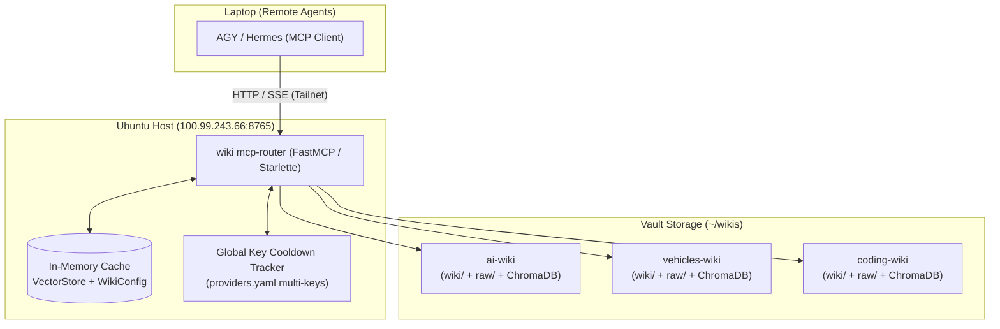

# Centralized Multi-Wiki MCP Router Plan & Specification (v2.0)

## 1. Executive Summary

The **Centralized Multi-Wiki MCP Router** serves as an always-on, unified gateway on the Ubuntu server (`100.99.243.66`), enabling remote AI agents (AGY, Hermes) across your Tailnet to seamlessly discover, traverse, query, and safely contribute notes to multiple independent Obsidian/LLM wikis.

By centralizing the router on the host:
- **Zero Local Client Footprint:** Remote agents do not require local LLM API keys, embedding models, or vector database binaries.
- **Full Knowledge Navigation:** Agents can browse whole-wiki skeletons, walk note-to-note graph backlinks, and inspect granular entity statistics.
- **Safe Write Paths:** Dedicated inbox and log appending tools eliminate Syncthing merge conflicts on compiled pages.
- **Global Key & Quota Optimization:** A centralized key rotation tracker shares rate-limit cooldowns across all wikis, preventing redundant API failures.

---

## 2. Architecture & Networking



### 2.1 Network & Port Strategy
- **Interface & Host:** Bound strictly to Tailscale IP `100.99.243.66` (or configurable via `--host`). Invisible to the public internet.
- **Port:** Default **`8765`** (configurable via `--port`). *(Leaves port `8080` reserved for Gotify).*
- **Transport Protocol:** Standard Model Context Protocol (MCP) Server-Sent Events (SSE) transport exposing:
  - `GET /sse` — SSE stream endpoint establishing the session.
  - `POST /messages?sessionId=...` — Bidirectional JSON-RPC message endpoint.

---

## 3. Directory Layout & Dynamic Vault Discovery

### 3.1 Vault Directory Convention
The router monitors a base folder (default: `~/wikis/`, configurable via `--base-dir`).
A folder `~/wikis/<vault_name>` is recognized as a valid wiki if:
1. `(vault_dir / "wiki").is_dir()` is true.
2. Metadata is extracted from `wiki.yaml` or `.llm-wiki/config.yaml` (falling back to folder name if absent).

### 3.2 Dynamic, Lazy Discovery
- No restart or explicit refresh commands required.
- Whenever `list_wikis()` or a tool is executed, the router performs a live scan of `--base-dir`.
- When Syncthing syncs a new wiki folder from a client, the router immediately recognizes it.

---

## 4. MCP Tools Suite

The router provides a comprehensive suite of 8 tools covering discovery, semantic querying, graph traversal, and safe contribution:

### 4.1 Discovery & Structure Tools

#### Tool 1: `list_wikis()`
* **Purpose:** Allows the agent to survey all available knowledge domains on the server.
* **Arguments:** None.
* **Returns:** JSON Array of rich summary objects:
  ```json
  [
    {
      "name": "ai-wiki",
      "description": "Knowledge base regarding AI models, architectures, and capabilities.",
      "page_count": 142
    },
    {
      "name": "vehicles-wiki",
      "description": "Documentation on EV powertrains, ICE comparisons, and hardware.",
      "page_count": 34
    }
  ]
  ```

#### Tool 2: `get_wiki_skeleton(wiki_name: str, category: Optional[str] = None)`
* **Purpose:** Returns the complete table of contents / skeleton of notes in the wiki.
* **Arguments:**
  - `wiki_name` (string): Target wiki vault.
  - `category` (optional string): Filter by category (e.g., `"concepts"`, `"entities"`, `"topics"`, `"comparisons"`, `"sources"`).
* **Returns:** Structured JSON dictionary of note slugs and titles grouped by category:
  ```json
  {
    "wiki_name": "ai-wiki",
    "categories": {
      "concepts": ["LoRA", "Quantization", "Mixture of Experts"],
      "entities": ["RoBERTa", "DeBERTa", "Claude 3.7", "Gemini 2.5 Flash"],
      "topics": ["Efficient Fine-Tuning", "Transformer Architectures"],
      "sources": ["lora-paper.pdf", "deepseek-v3.md"]
    }
  }
  ```

#### Tool 3: `get_wiki_status(wiki_name: str)`
* **Purpose:** Returns structural metrics and category counts for a wiki.
* **Arguments:**
  - `wiki_name` (string): Target wiki vault.
* **Returns:** Clean, content-focused JSON object:
  ```json
  {
    "wiki_name": "ai-wiki",
    "total_pages": 42,
    "raw_sources": 10,
    "concepts": 15,
    "entities": 20,
    "topics": 7,
    "last_updated": "2026-10-07"
  }
  ```

---

### 4.2 Reading & Querying Tools

#### Tool 4: `query_wiki(wiki_name: str, query: str)`
* **Purpose:** Runs a semantic RAG query against the specified wiki using server-side providers and fallback chains.
* **Arguments:**
  - `wiki_name` (string): Target wiki vault.
  - `query` (string): Natural language query.
* **Returns:** **Plain Markdown string**. Synthesized answer including all `[[wikilinks]]` and source citations.
* **Performance Caching:** Reuses in-memory `_store_cache: Dict[str, VectorStore]` to execute queries without disk reloads.

#### Tool 5: `read_wiki_page(wiki_name: str, page_slug: str)`
* **Purpose:** Fetches the raw Markdown content of a specific note within a wiki.
* **Arguments:**
  - `wiki_name` (string): Target wiki vault.
  - `page_slug` (string): Name or path of the note.
* **Returns:** Raw Markdown string content.
* **Flexible Slug Resolution Algorithm:**
  1. Appends `.md` if missing.
  2. Resolves direct relative path first (`wiki / page_slug`).
  3. Strips prefixes (e.g., `entities/roberta.md` -> `roberta.md`) and recursively scans `wiki/` matching filename or stem.
  4. Verifies path remains inside `wiki/` to prevent directory traversal.

---

### 4.3 Knowledge Graph Traversal Tools

#### Tool 6: `get_page_links(wiki_name: str, page_slug: str)`
* **Purpose:** Enables the agent to "walk" the knowledge graph by discovering connected notes.
* **Arguments:**
  - `wiki_name` (string): Target wiki vault.
  - `page_slug` (string): Target note name.
* **Returns:** JSON object containing outgoing links and incoming backlinks:
  ```json
  {
    "page": "RoBERTa",
    "outgoing_links": ["BERT", "WikiSQL", "GLUE Benchmark"],
    "backlinks": ["LoRA", "DeBERTa", "lora-paper"]
  }
  ```

#### Tool 7: `get_entity_info(wiki_name: str, entity_name: str)`
* **Purpose:** Returns deep structural context and metadata for a specific entity or concept.
* **Arguments:**
  - `wiki_name` (string): Target wiki vault.
  - `entity_name` (string): Name of the concept or entity.
* **Returns:** JSON object with frontmatter (`type`, `confidence`, `created`, `updated`), source citations list, and first-paragraph summary.

---

### 4.4 Safe Contribution (Write) Tools

#### Tool 8: `add_inbox_note(wiki_name: str, title: str, content: str, tags: Optional[List[str]] = None)`
* **Purpose:** Allows remote agents to safely capture new research notes or raw content into the wiki without causing Syncthing conflicts.
* **Arguments:**
  - `wiki_name` (string): Target wiki vault.
  - `title` (string): Title of the new note.
  - `content` (string): Markdown content.
  - `tags` (optional list of strings): Associated tags.
* **Action:** Writes a new file to `~/wikis/{wiki_name}/raw/inbox/{date}-{slug}.md` with frontmatter. The local server watcher/pipeline can then ingest it into the official compiled knowledge base.
* **Returns:** Confirmation string with the saved file path.

#### Tool 9: `append_to_log(wiki_name: str, entry_text: str)`
* **Purpose:** Appends a timestamped research finding or agent note to `wiki/log.md`.
* **Arguments:**
  - `wiki_name` (string): Target wiki vault.
  - `entry_text` (string): Text entry to record.
* **Returns:** `"Successfully appended to wiki/log.md"`.

---

## 5. Multi-Key Rotation & Global Rate-Limit Cooldown

The router centralizes all LLM calls through a single `LLMProvider` instance managing `~/.config/llm-wiki/providers.yaml`.

```
                    Central LLM Provider
                             │
            ┌────────────────┴────────────────┐
            ▼                                 ▼
   Primary Key Pool                  Cooldown Tracker
   (Google 2..9, Groq 1..7)          { "groq 1": 1728312000 }
            │                                 │
            └───────────────┬─────────────────┘
                            ▼
              Query Execution (Skip Cooled Keys)
```

1. **Shared State:** When any model/key (e.g. `groq 1`) encounters an HTTP `429` (Rate Limit) or `resource_exhausted` quota error, it is recorded in `RateLimitCooldownTracker` with `cooldown_until = now() + 60s`.
2. **Instant Skipping:** Subsequent queries from **any** wiki immediately skip `groq 1` and proceed directly to `groq 2` without incurring network timeout delays.
3. **Seamless Recovery:** When the 60-second window expires, `groq 1` is automatically restored to rotation.

---

## 6. Development & Deployment Lifecycle

### 6.1 Safe Feature Addition (Zero-Downtime)
1. **Source Installation:** The CLI is installed in editable mode (`pipx install -e "/home/ubuntu/llm wiki"`), so code changes in the repo take effect immediately upon process restart.
2. **Automated Verification:** Run the full test suite (`uv run --with pytest pytest tests/`) before restarting.
3. **Dual-Port Testing:** To test changes live with AGY before affecting production:
   ```bash
   wiki mcp-router --base-dir ~/wikis --host 100.99.243.66 --port 8766
   ```
   *(Production on port 8765 remains online and unaffected).*
4. **Instant Production Reload:** Once verified, restart the systemd service in under a second:
   ```bash
   systemctl --user restart llm-wiki-router.service
   ```
   Connected MCP clients automatically reconnect on their next request.

---

## 7. Systemd Service Deployment Template

File: `~/.config/systemd/user/llm-wiki-router.service`
```ini
[Unit]
Description=LLM Multi-Wiki Centralized MCP Router
After=network.target

[Service]
Type=simple
ExecStart=/home/ubuntu/.local/bin/wiki mcp-router --base-dir /home/ubuntu/wikis --host 100.99.243.66 --port 8765
Restart=always
RestartSec=5
WorkingDirectory=/home/ubuntu
Environment=PYTHONUNBUFFERED=1

[Install]
WantedBy=default.target
```

### Deployment Commands:
```bash
# 1. Enable lingering so user services stay active across SSH logouts
loginctl enable-linger $USER

# 2. Reload daemon and start service
systemctl --user daemon-reload
systemctl --user enable --now llm-wiki-router.service

# 3. Check service status
systemctl --user status llm-wiki-router.service
```

---

## 8. Client Agent Configuration

In AGY or Hermes on your laptop (`~/.config/antigravity/mcp.json` or equivalent):
```json
{
  "mcpServers": {
    "global-wiki-router": {
      "url": "http://100.99.243.66:8765/sse"
    }
  }
}
```
*(No local API keys or models required on the client machine).*
